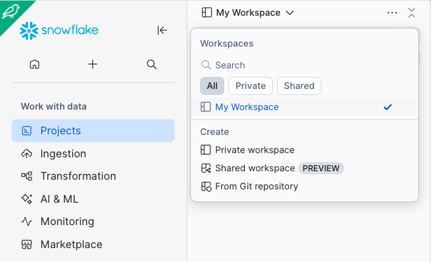
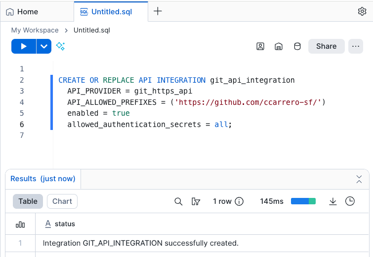
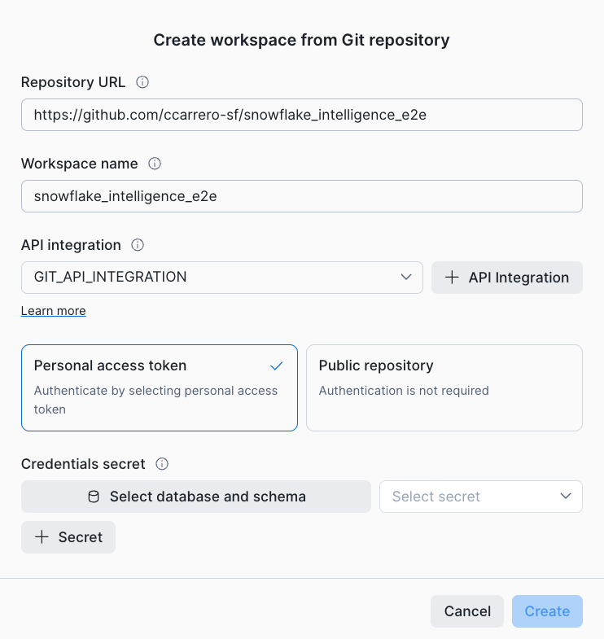
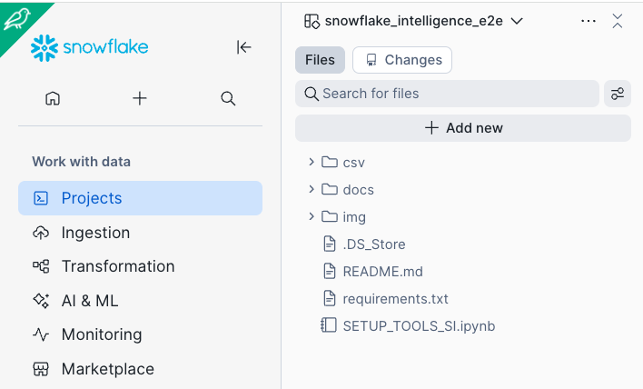
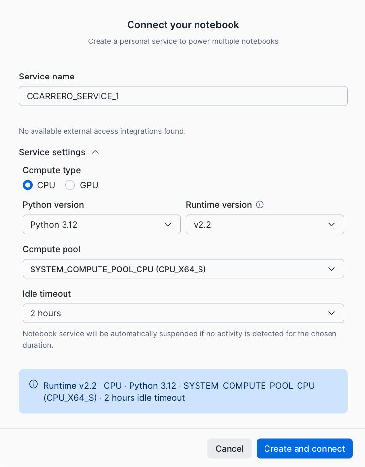
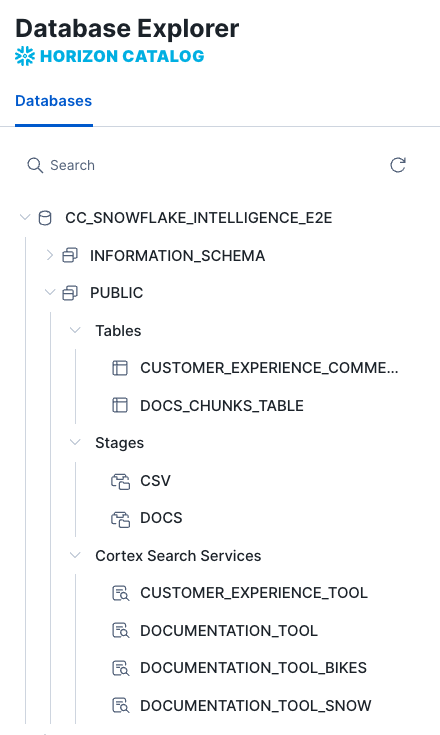
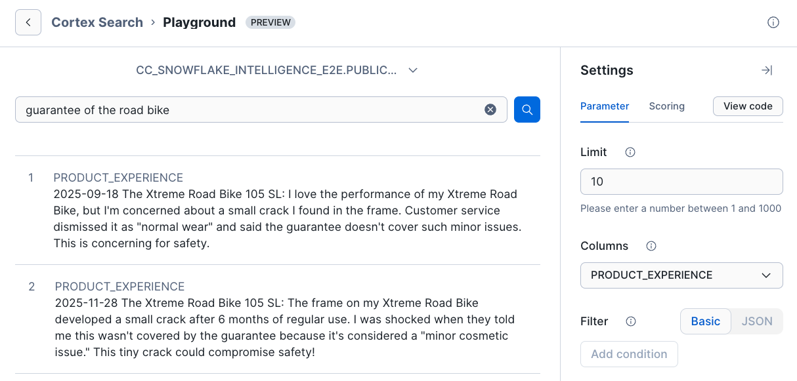

# Building Cortex Agents & Snowflake Intelligence End-to-End Hands-On Lab

This lab will explain step by step how to build a Data Agent using Snowflake Cortex Agents, how to use them within Snowflake Intelligence and how to evaluate their performance using AI Observabiity in Snowflake Cortex. You will be able to build a Data Agent that is able to use both Structured and Unstructured data to answer sales assistant questions.

First step will be to build the Tools that will be provided to the Data Agent in order to do the work. Snowflake provides two very powerful tools in order to use Structured and Unstructured data: Cortex Analyst and Cortex Search.

A custom and unique dataset about bikes and skis will be used by this setup, but you should be able to use your own data. This artificial dataset's goal is to make sure that we are using data not available on the Internet, so no LLM will be able to know about our own data.

The first step will be to create your own Snowflake Trial Account (or use the one provided for you during this hands-on lab). Once you have created it, you will be using Snowflake GIT integration to get access to all the data that will be needed during this lab.

This lab leverages Snowflake Notebooks within Workspaces and their GIT integration. 

## Step 1: Create a new Workspace from the GIT repository 

Select Projects -> Workspaces. Click on My Workspace and within Create click on "From Git repository"



If you do not have a API integration already created, when creating the workspace from Git repository you have the opportunity to create it. In the repository URL add:

``` sql
https://github.com/ccarrero-sf/snowflake_intelligence_e2e
```
If you need to create an API Integration, click on "Create API integration", this will bring you to one SQL where you can run:

``` sql
CREATE OR REPLACE API INTEGRATION git_api_integration
  API_PROVIDER = git_https_api
  API_ALLOWED_PREFIXES = ('https://github.com/ccarrero-sf/')
  enabled = true
  allowed_authentication_secrets = all;
``` 
Click on the Run buttom. 



When creating a workspace from a Git repository you have the opportunity to add your Personal access token. Because this is a public lab, just select on Public repository and click on Create.



Now you should have all files we are going to need for this lab in your Snowflake account:



## Run the SETUP_TOOLS_SI.ipynb Notebook

Under the snowflake_intelligence_e2e workspace, click on the SETUP_TOOLS_SI.ipynb notebook. Next step is to connect it to a personal service that will be running within Snowpark Container Services. Click on "Connect":


Edit the Service Settings where you can change the runtime, compute pool and idle timeout. Modify the idle timeout to just 2 hours to avoid consuming credits once this lab is completed. Modify and click on Create and Connect:



Once the notebook is connected, you can run it. We are going to review here each step taken. Feel free to run each cell of the notebook and follow this guide to have a better understanding of each step.

## Setup Database for the Sales Assistant Agent

We are going to create a fresh database where we will place all objects needed for our Agents. We will also leverage the Git integration we have with this workspace to get access to PDF files, images and some CSV data with sales info.

This will create the database to be used (check you do not have a similar one as it will be re-created) and two staging areas, one to hold PDF and Images and other for CSV files. Note that those could be already in an external S3 location. 

```SQL
CREATE OR REPLACE DATABASE CC_SNOWFLAKE_INTELLIGENCE_E2E;
USE DATABASE CC_SNOWFLAKE_INTELLIGENCE_E2E;

create or replace stage docs ENCRYPTION = (TYPE = 'SNOWFLAKE_SSE') DIRECTORY = ( ENABLE = true );
create or replace stage csv ENCRYPTION = (TYPE = 'SNOWFLAKE_SSE') DIRECTORY = ( ENABLE = true );
```

As we have the files in the workspace, we can copy them to those staging areas:

```SQL
session.file.put("csv/*", "@CSV", auto_compress = False)
session.file.put("docs/*", "@DOCS", auto_compress = False)
```

In the other cells of this section we are getting a session handler that we can use with Snowpark

## Setup Roles

This lab will demostrate how we can leverage Row Access Policies so different roles can only see the data they are allowed to. As we have Bike and Snow products, we will define two different roles, one for Bikes and another for Snow, i order to demostrate how Agents will leverage Snowflake governance capabilities in order to only access the data the Agent is allowed to, based on the role being used.

It is convenient you choose your own passwords:

```SQL
create role if not exists BIKE_ROLE;
create role if not exists SNOW_ROLE;
create role if not exists BIKE_SNOW_ROLE;

GRANT ROLE BIKE_ROLE TO ROLE ACCOUNTADMIN;
GRANT ROLE SNOW_ROLE TO ROLE ACCOUNTADMIN;
GRANT ROLE BIKE_SNOW_ROLE TO ROLE ACCOUNTADMIN;

CREATE USER IF NOT EXISTS bike_user PASSWORD = 'Password123!' DEFAULT_ROLE = BIKE_ROLE;
grant role BIKE_ROLE to user bike_user;

CREATE USER IF NOT EXISTS snow_user PASSWORD = 'Password123!' DEFAULT_ROLE = SNOW_ROLE;
grant role SNOW_ROLE to user snow_user;

CREATE USER IF NOT EXISTS all_user PASSWORD = 'Password123!' DEFAULT_ROLE = BIKE_SNOW_ROLE;
grant role BIKE_SNOW_ROLE to user all_user;
```

## Unstructured Data Processing for PDFs (Product Documentation)

Check the content of the directory with documents (PDF and JPEG). Note that this is an internal staging area but it could also be an external S3 location, so there is no need to actually copy the PDFs into Snowflake. 

```SQL
SELECT * FROM DIRECTORY('@DOCS');
```
### PDF Documents

To parse the documents, we are going to use the native Cortex [PARSE_DOCUMENT](https://docs.snowflake.com/en/sql-reference/functions/parse_document-snowflake-cortex). For LAYOUT we can specify OCR or LAYOUT. We will be using LAYOUT so the content is markdown formatted.

```SQL

CREATE OR REPLACE TEMPORARY TABLE RAW_TEXT AS
WITH FILE_TABLE as (
  (SELECT 
        RELATIVE_PATH,
        build_scoped_file_url(@docs, relative_path) as scoped_file_url,
        TO_FILE('@DOCS', RELATIVE_PATH) AS docs 
    FROM 
        DIRECTORY(@DOCS))
)
SELECT 
    RELATIVE_PATH,
    scoped_file_url,
    TO_VARCHAR (
        SNOWFLAKE.CORTEX.AI_PARSE_DOCUMENT (
            docs,
            {'mode': 'LAYOUT'} ):content
        ) AS EXTRACTED_LAYOUT 
FROM 
    FILE_TABLE
WHERE
    RELATIVE_PATH LIKE '%.pdf';
```

Next we are going to split the content of the PDF file into chunks with some overlaps to make sure information and context are not lost. You can read more about token limits and text splitting in the [Cortex Search Documentation ](https://docs.snowflake.com/en/user-guide/snowflake-cortex/cortex-search/cortex-search-overview)

Create the table that will be used by Cortex Search Service as a Tool for Cortex Agents in order to retrieve information from PDF and JPEG files. Note we are adding a USER_ROLE column that we are going to use to filter who can get access to that information:

```SQL
create or replace TABLE DOCS_CHUNKS_TABLE ( 
    RELATIVE_PATH VARCHAR(16777216), -- Relative path to the PDF file
    scoped_file_url VARCHAR(16777216),
    CHUNK VARCHAR(16777216), -- Piece of text
    CHUNK_INDEX INTEGER, -- Index for the text
    USER_ROLE VARCHAR(16777216), -- Role that can access to this row
    CATEGORY VARCHAR(16777216)
);
```

To split the text we also use the native Cortex [SPLIT_TEXT_RECURSIVE_CHARACTER](https://docs.snowflake.com/en/sql-reference/functions/split_text_recursive_character-snowflake-cortex). 

```SQL
-- Create chunks from extracted content
insert into DOCS_CHUNKS_TABLE (relative_path, chunk, chunk_index)

    select relative_path, 
            c.value::TEXT as chunk,
            c.INDEX::INTEGER as chunk_index
            
    from 
        raw_text,
        LATERAL FLATTEN( input => SNOWFLAKE.CORTEX.SPLIT_TEXT_RECURSIVE_CHARACTER (
              EXTRACTED_LAYOUT,
              'markdown',
              1512,
              256,
              ['\n\n', '\n', ' ', '']
           )) c;

SELECT * FROM DOCS_CHUNKS_TABLE;
```

As a demo, we are going to show how to use AI_CLASSIFY Cortex function to classify the document type. We have two classes: Bike and Snow, and we will pass the document title and the first chunk of the document to the function

```SQL
CREATE OR REPLACE TEMPORARY TABLE docs_categories AS WITH unique_documents AS (
  SELECT
    DISTINCT relative_path, chunk
  FROM
    docs_chunks_table
  WHERE 
    chunk_index = 0
  ),
 docs_category_cte AS (
  SELECT
    relative_path,
    TRIM(snowflake.cortex.AI_CLASSIFY (
      'Title:' || relative_path || 'Content:' || chunk, ['Bike', 'Snow']
     )['labels'][0], '"') AS CATEGORY
  FROM
    unique_documents
)
SELECT
  *
FROM
  docs_category_cte;
```

You can check the categories:

```SQL
select * from docs_categories;
```
Update the table and define what role can use each type of document:

```SQL
UPDATE docs_chunks_table dct
SET
    category = dc.category,
    USER_ROLE = CASE
                    WHEN dc.CATEGORY = 'Bike' THEN 'BIKE_ROLE'
                    WHEN dc.CATEGORY = 'Snow' THEN 'SNOW_ROLE'
                    ELSE NULL -- Or a default role if categories other than 'Bike' or 'Snow' are possible
                END
FROM
    docs_categories dc
WHERE
    dct.relative_path = dc.relative_path;
```
## Processing IMAGE Documents

Now let's process the images we have for our bikes and skis. We are going to use AI_COMPLETE and AI_CLASSIFY multi-modal function asking for an image description and classification. We add it into the DOCS_CHUNKS_TABLE where we also have the PDF documentation. For AI_COMPLETE for Multi-Modal we are proposing claude-3-7-sonnet, but you should check what is the availability in your [region]( https://docs.snowflake.com/en/sql-reference/functions/ai_complete-single-file). 

We are going to run the next cell first to enable [CROSS REGION INFERENCE](https://docs.snowflake.com/en/user-guide/snowflake-cortex/cross-region-inference). In our case, this is running within AWS_EU region and we want to keep it there. 

```SQL
ALTER ACCOUNT SET CORTEX_ENABLED_CROSS_REGION = 'AWS_EU';
```

If you have an account in US and you want to keep it in that region , you can run this instead:

```SQL
ALTER ACCOUNT SET CORTEX_ENABLED_CROSS_REGION = 'AWS_US';
```


```SQL
INSERT INTO DOCS_CHUNKS_TABLE (relative_path, scoped_file_url, chunk, chunk_index, category, USER_ROLE)
WITH classified_docs AS (
    SELECT
        RELATIVE_PATH,
        build_scoped_file_url(@docs, relative_path) as scoped_file_url,
        CONCAT('This is a picture describing: ' || RELATIVE_PATH ||
            ' .THIS IS THE DESCRIPTION: ' ||
            SNOWFLAKE.CORTEX.AI_COMPLETE('claude-3-5-sonnet',
            'This should be an image of a bike or snow gear. Provide all the detail that
            you can. Try to extract colors, brand names, parts, etc: ',
            TO_FILE('@DOCS', RELATIVE_PATH))) AS chunk,
        0 AS chunk_index,
        -- Calculate category once
        SNOWFLAKE.CORTEX.AI_CLASSIFY(
            TO_FILE('@DOCS', RELATIVE_PATH),
            ['Bike', 'Snow']):labels[0] AS category
    FROM
        DIRECTORY('@DOCS')
    WHERE
        RELATIVE_PATH LIKE '%.jpeg'
)
SELECT
    cd.relative_path,
    cd.scoped_file_url,
    cd.chunk,
    cd.chunk_index,
    cd.category,
    -- Use the calculated category to derive USER_ROLE
    CASE
        WHEN cd.category LIKE '%Bike%' THEN 'BIKE_ROLE'
        WHEN cd.category LIKE '%Snow%' THEN 'SNOW_ROLE'
        ELSE NULL -- Or a default role if categories other than 'Bike' or 'Snow' are possible
    END AS USER_ROLE
FROM
    classified_docs cd;
```

Check the descriptions created and the Tool that will be used to retrieve information when needed:

```SQL
select * from DOCS_CHUNKS_TABLE
    where RELATIVE_PATH LIKE '%.jpeg';
```

At this point we should have only 2 roles. Check:

```SQL
select distinct(USER_ROLE) from DOCS_CHUNKS_TABLE;
```

### Enable Cortex Search Service for the Documentation and Images

Now that we have processed the PDF and IMAGE documents, we can create a [Cortex Search Service](https://docs.snowflake.com/en/user-guide/snowflake-cortex/cortex-search/cortex-search-overview) that automatically will create embeddings and indexes over the chunks of text extracted. Read the docs for the different embedding models available.

When creating the service, we also specify what is the TARGET_LAG. This is the frequency used by the service to maintain the service with new or deleted data. Check the [Automatic Processing of New Documents](https://quickstarts.snowflake.com/guide/ask_questions_to_your_own_documents_with_snowflake_cortex_search/index.html?index=..%2F..index#6) of that quickstart to understand how easy is to maintain your RAG updated when using Cortex Search.

We also want to limit what documents can be accessed depending on the role being used. We have two options here, we could filter the role at the Agent level as user_role is being defined as one ATTRIBUTE, or we could filter when creating the service for each role. We are going to try this, where we keep one single table but create different Cortex Search Services depending on the role:

```SQL
create or replace CORTEX SEARCH SERVICE DOCUMENTATION_TOOL
ON chunk
ATTRIBUTES category, user_role
warehouse = COMPUTE_WH
TARGET_LAG = '1 hour'
EMBEDDING_MODEL = 'snowflake-arctic-embed-l-v2.0'
as (
    select chunk,
        chunk_index,
        relative_path,
        scoped_file_url,
        category,
        user_role
    from docs_chunks_table
);
```

One service for Bikes:

```SQL
create or replace CORTEX SEARCH SERVICE DOCUMENTATION_TOOL_BIKES
ON chunk
ATTRIBUTES category, user_role
warehouse = COMPUTE_WH
TARGET_LAG = '1 hour'
EMBEDDING_MODEL = 'snowflake-arctic-embed-l-v2.0'
as (
    select chunk,
        chunk_index,
        relative_path,
        scoped_file_url,
        category,
        user_role
    from docs_chunks_table
    where user_role = 'BIKE_ROLE'
);
```

And one service for Ski:

```SQL
create or replace CORTEX SEARCH SERVICE DOCUMENTATION_TOOL_SNOW
ON chunk
ATTRIBUTES category, user_role
warehouse = COMPUTE_WH
TARGET_LAG = '1 hour'
EMBEDDING_MODEL = 'snowflake-arctic-embed-l-v2.0'
as (
    select chunk,
        chunk_index,
        relative_path,
        scoped_file_url,
        category,
        user_role
    from docs_chunks_table
    where user_role = 'SNOW_ROLE'
);
```

Now we are going to grant access to those services to the different roles:

```SQL
-- BIKE_ROLE:

GRANT USAGE ON CORTEX SEARCH SERVICE DOCUMENTATION_TOOL_BIKES TO ROLE BIKE_ROLE;

--- SNOW_ROLE:

GRANT USAGE ON CORTEX SEARCH SERVICE DOCUMENTATION_TOOL_SNOW TO ROLE SNOW_ROLE;

-- BIKE_SNOW_ROLE:

GRANT USAGE ON CORTEX SEARCH SERVICE DOCUMENTATION_TOOL TO ROLE BIKE_SNOW_ROLE;
```

After this step, we have one tool ready to retrieve context from PDF and IMAGE files.

## Tools for Unstructured Data (Customer Reviews)

In the previous step we have processed Unstructured data in the format of PDF files. Next we are going to process the customer reviews that are already located in a Snowflake table within a column. We will enable Cortex Search so we can create a tool for our agents that will retreive customer reviews.

The customer reviews for our products are already located in CSV file that we can copy into a Snoflake table:

```SQL
CREATE OR REPLACE TABLE customer_experience_comments (
    id INT,
    experience_date DATE,
    product_id INT,
    product_name VARCHAR(100),
    comment TEXT
);

COPY INTO customer_experience_comments (
    id,
    experience_date,
    product_id,
    product_name,
    comment
)
FROM @csv/customer_experience_comments.csv
FILE_FORMAT = (
    TYPE = 'CSV'
    FIELD_DELIMITER = ','
    RECORD_DELIMITER = '\n'
    SKIP_HEADER = 1
    FIELD_OPTIONALLY_ENCLOSED_BY = '"'
    NULL_IF = ('NULL', 'null', '')
    ERROR_ON_COLUMN_COUNT_MISMATCH = TRUE
);
```

And now we can just create a Cortex Search Service on that table, we we index on the date, product_name and customer comments:

```SQL
create or replace CORTEX SEARCH SERVICE CUSTOMER_EXPERIENCE_TOOL
ON product_experience
warehouse = COMPUTE_WH
TARGET_LAG = '1 hour'
EMBEDDING_MODEL = 'snowflake-arctic-embed-l-v2.0'
as (
    select experience_date, product_id, product_name, comment,
    CONCAT(experience_date, ' ', product_name, ': ', comment) AS product_experience
    from customer_experience_comments
);
```

At the point, if you click on the Catalog and select your database, you can see the objects already created:



Under AI & ML -> Search, you can also find the services we have created that will be used as Tools by the Agents:


You can use the Playground to interact with any of these services and test it. Click on CUSTOMER_EXPERIENCE_TOOL. You will see all details about that service. You have the URL to access the service or Python example. If you click on Data Preview you will see how Embeddings have been automatically created for you. Cost of the service can also be seen here.

Click on Playground and enter some text. Cortex Search will provide to chunks with higher vector and keyword similarity with very low latency:




## Set Up Structured Data to be Used by the Agent
Another Tool that we will provide to the Cortex Agent will be Cortex Analyst, which will provide the capability to extract information from Snowflake Tables. In the API call we will provide the location of a Semantic file that contains information about the business terminology used to describe the data.

First we are going to create some synthetic data about the bike and ski products that we have.

We are going to create the following tables with content:

**DIM_ARTICLE – Article/Item Dimension**

Purpose: Stores descriptive information about the products (articles) being sold.

Key Columns:

    ARTICLE_ID (Primary Key): Unique identifier for each article.
    ARTICLE_NAME: Full name/description of the product.
    ARTICLE_CATEGORY: Product category (e.g., Bike, Skis, Ski Boots).
    ARTICLE_BRAND: Manufacturer or brand (e.g., Mondracer, Carver).
    ARTICLE_COLOR: Dominant color for the article.
    ARTICLE_PRICE: Standard unit price of the article.
    DIM_CUSTOMER – Customer Dimension

**DIM_CUSTOMER – Customer Dimension**

Purpose: Contains demographic and segmentation info about each customer.

Key Columns:

    CUSTOMER_ID (Primary Key): Unique identifier for each customer.
    CUSTOMER_NAME: Display name for the customer.
    CUSTOMER_REGION: Geographic region (e.g., North, South).
    CUSTOMER_AGE: Age of the customer.
    CUSTOMER_GENDER: Gender (Male/Female).
    CUSTOMER_SEGMENT: Marketing segment (e.g., Premium, Regular, Occasional).
    FACT_SALES – Sales Transactions Fact Table

**FACT_SALES – Sales Transactions Fact Table**

Purpose: Captures individual sales transactions (facts) with references to article and customer details.

Key Columns:

    SALE_ID (Primary Key): Unique identifier for the transaction.
    ARTICLE_ID (Foreign Key): Links to DIM_ARTICLE.
    CUSTOMER_ID (Foreign Key): Links to DIM_CUSTOMER.
    DATE_SALES: Date when the sale occurred.
    QUANTITY_SOLD: Number of units sold in the transaction.
    TOTAL_PRICE: Total transaction value (unit price × quantity).
    SALES_CHANNEL: Sales channel used (e.g., Online, In-Store, Partner).
    PROMOTION_APPLIED: Boolean indicating if the sale involved a promotion or discount.

You can continue executing the Notebook cells to create some synthetic data. 

First some data for articles:

```SQL
CREATE OR REPLACE TABLE DIM_ARTICLE (
    ARTICLE_ID INT PRIMARY KEY,
    ARTICLE_NAME STRING,
    ARTICLE_CATEGORY STRING,
    ARTICLE_BRAND STRING,
    ARTICLE_COLOR STRING,
    ARTICLE_PRICE FLOAT
);

INSERT INTO DIM_ARTICLE (ARTICLE_ID, ARTICLE_NAME, ARTICLE_CATEGORY, ARTICLE_BRAND, ARTICLE_COLOR, ARTICLE_PRICE)
VALUES 
(1, 'Mondracer Infant Bike', 'Bike', 'Mondracer', 'Green', 3000),
(2, 'Premium Bicycle', 'Bike', 'Veloci', 'Red', 9000),
(3, 'Ski Boots TDBootz Special', 'Ski Boots', 'TDBootz', 'White', 600),
(4, 'The Ultimate Downhill Bike', 'Bike', 'Graviton', 'Red', 10000),
(5, 'The Xtreme Road Bike 105 SL', 'Bike', 'Xtreme', 'Grey', 8500),
(6, 'Carver Skis', 'Skis', 'Carver', 'White', 790),
(7, 'Outpiste Skis', 'Skis', 'Outpiste', 'Grey', 900),
(8, 'Racing Fast Skis', 'Skis', 'RacerX', 'Grey', 950);
```

We are going to use [Row Access Policies](https://docs.snowflake.com/en/user-guide/security-row-intro) in order to define what rows can be retrieved for each of the roles. These policies will be respected by the Agents that will be quering the sales tables.

In our case, the BIKE_ROLE will be able to see the rows containing bike products and the SNOW_ROLE will be able to access Snow articles.

First we define a tabe with the mapping of who can do what:


```SQL
CREATE OR REPLACE TABLE ROW_ACCESS_MAPPING(
    ALLOWED_CATEGORY STRING,
    ALLOWED_ROLE STRING
);

INSERT INTO ROW_ACCESS_MAPPING (ALLOWED_CATEGORY, ALLOWED_ROLE)
VALUES
('Bike', 'BIKE_ROLE'),
('Ski Boots', 'SNOW_ROLE'),
('Skis', 'SNOW_ROLE'),
('Bike', 'BIKE_SNOW_ROLE'),
('Ski Boots', 'BIKE_SNOW_ROLE'),
('Skis', 'BIKE_SNOW_ROLE')
;
```

 We also define the Row Access Policies:

```SQL
CREATE OR REPLACE ROW ACCESS POLICY categories_policy
AS (ARTICLE_CATEGORY varchar) RETURNS BOOLEAN ->
    'ACCOUNTADMIN' = current_role()
    or exists(
        select * from ROW_ACCESS_MAPPING
            where allowed_role = current_role()
            and allowed_category = ARTICLE_CATEGORY
    );
```

Apply it to the DIM_ARTICLE table:

```SQL
ALTER TABLE DIM_ARTICLE
  ADD ROW ACCESS POLICY categories_policy
  ON (ARTICLE_CATEGORY);
```

Data for Customers:

```SQL
CREATE OR REPLACE TABLE DIM_CUSTOMER (
    CUSTOMER_ID INT PRIMARY KEY,
    CUSTOMER_NAME STRING,
    CUSTOMER_REGION STRING,
    CUSTOMER_AGE INT,
    CUSTOMER_GENDER STRING,
    CUSTOMER_SEGMENT STRING
);

INSERT INTO DIM_CUSTOMER (CUSTOMER_ID, CUSTOMER_NAME, CUSTOMER_REGION, CUSTOMER_AGE, CUSTOMER_GENDER, CUSTOMER_SEGMENT)
SELECT 
    SEQ4() AS CUSTOMER_ID,
    'Customer ' || SEQ4() AS CUSTOMER_NAME,
    CASE MOD(SEQ4(), 5)
        WHEN 0 THEN 'North'
        WHEN 1 THEN 'South'
        WHEN 2 THEN 'East'
        WHEN 3 THEN 'West'
        ELSE 'Central'
    END AS CUSTOMER_REGION,
    UNIFORM(18, 65, RANDOM()) AS CUSTOMER_AGE,
    CASE MOD(SEQ4(), 2)
        WHEN 0 THEN 'Male'
        ELSE 'Female'
    END AS CUSTOMER_GENDER,
    CASE MOD(SEQ4(), 3)
        WHEN 0 THEN 'Premium'
        WHEN 1 THEN 'Regular'
        ELSE 'Occasional'
    END AS CUSTOMER_SEGMENT
FROM TABLE(GENERATOR(ROWCOUNT => 5000));
```

And Sales data from the CSV file:

```SQL
CREATE OR REPLACE TABLE FACT_SALES (
    SALE_ID INT PRIMARY KEY,
    ARTICLE_ID INT,
    DATE_SALES DATE,
    CUSTOMER_ID INT,
    QUANTITY_SOLD INT,
    TOTAL_PRICE FLOAT,
    SALES_CHANNEL STRING,
    PROMOTION_APPLIED BOOLEAN,
    FOREIGN KEY (ARTICLE_ID) REFERENCES DIM_ARTICLE(ARTICLE_ID),
    FOREIGN KEY (CUSTOMER_ID) REFERENCES DIM_CUSTOMER(CUSTOMER_ID)
);

COPY INTO FACT_SALES (
    SALE_ID,
    ARTICLE_ID, 
    DATE_SALES,
    CUSTOMER_ID,
    QUANTITY_SOLD,
    TOTAL_PRICE,
    SALES_CHANNEL,
    PROMOTION_APPLIED
)
FROM @csv/fact_sales.csv
FILE_FORMAT = (
    TYPE = 'CSV'
    FIELD_DELIMITER = ','
    RECORD_DELIMITER = '\n'
    SKIP_HEADER = 1
    FIELD_OPTIONALLY_ENCLOSED_BY = '"'
    NULL_IF = ('NULL', 'null', '')
    ERROR_ON_COLUMN_COUNT_MISMATCH = TRUE
);
```

### Improving Tool Usage with Dynamic Literal Retrieval

Thanks to the Cortex Analyst integration with Cortex Search, we can improve the retrieval of all possible values of a column. Instead of listing all the possible values in the semantic file, we can use Cortex Search Integration.

Let's use it as example for the ARTICLE NAMES, so we do not have to list all.

```SQL
CREATE OR REPLACE TABLE ARTICLE_NAMES AS
  SELECT
      DISTINCT ARTICLE_NAME AS ARTICLE_NAME
  FROM DIM_ARTICLE;

CREATE OR REPLACE CORTEX SEARCH SERVICE _ARTICLE_NAME_SEARCH
  ON ARTICLE_NAME
  WAREHOUSE = COMPUTE_WH
  TARGET_LAG = '1 day'
  EMBEDDING_MODEL = 'snowflake-arctic-embed-l-v2.0'
AS (
  SELECT
       ARTICLE_NAME
  FROM ARTICLE_NAMES
);
```
Now we have the data that we need to get information about product sales. Next is to define the Semantic Model that will be used by Cortex Analyst in order to generate the right SQL when a question is being asked using natural language.

## Semantic Model Definition for Cortex Analyst

Semantic models map business terminology to database schemas and add contextual meaning. Here we define the tables, their relationships, and the description for their dimensions and facts.

We can also produce specific instructions that will help Cortex Analyst to provide the right SQL.

Cortex Analyst will be used by the agents as the Tool to retrieve information from Snowflake Table that needs to be extracted using SQL.

You can create the Semantic Model using Snowsight, click on AI & ML - > Analyst -> Create new. THen you can select your database, select tables and columns. You can also create a Semantic View programatically using the following SQL:

```SQL
create or replace semantic view SALES_DATA_SEMANTIC_VIEW
	tables (
		CC_SNOWFLAKE_INTELLIGENCE_E2E.PUBLIC.DIM_ARTICLE primary key (ARTICLE_ID),
		CC_SNOWFLAKE_INTELLIGENCE_E2E.PUBLIC.DIM_CUSTOMER primary key (CUSTOMER_ID),
		CC_SNOWFLAKE_INTELLIGENCE_E2E.PUBLIC.FACT_SALES primary key (CUSTOMER_ID,ARTICLE_ID)
	)
	relationships (
		ARTICLE_JOIN as FACT_SALES(ARTICLE_ID) references DIM_ARTICLE(ARTICLE_ID),
		CUSTOMER_JOIN as FACT_SALES(CUSTOMER_ID) references DIM_CUSTOMER(CUSTOMER_ID)
	)
	facts (
		DIM_ARTICLE.ARTICLE_ID as ARTICLE_ID with synonyms=('article_key','article_reference','item_id','item_number','product_code','product_id') comment='Unique identifier for an article in the inventory.',
		DIM_ARTICLE.ARTICLE_PRICE as ARTICLE_PRICE with synonyms=('article_value','item_cost','list_price','product_price','retail_price','sale_price','unit_price') comment='The price of an article, representing the monetary value assigned to a specific article or product.',
		DIM_CUSTOMER.CUSTOMER_AGE as CUSTOMER_AGE with synonyms=('age_of_customer','customer_birth_year','customer_dob','customer_maturity','years_old') comment='The age of the customer at the time of data collection, representing the number of years since birth.',
		DIM_CUSTOMER.CUSTOMER_ID as CUSTOMER_ID with synonyms=('account_number','client_id','client_identifier','customer_key','patron_id','subscriber_id','user_id') comment='Unique identifier for each customer in the database.',
		FACT_SALES.ARTICLE_ID as ARTICLE_ID with synonyms=('article_number','item_code','item_id','item_number','product_code','product_id','product_number') comment='Unique identifier for the article being sold.',
		FACT_SALES.CUSTOMER_ID as CUSTOMER_ID with synonyms=('account_id','buyer_id','client_id','client_number','customer_number','patron_id','user_id') comment='Unique identifier for the customer who made the sale.',
		FACT_SALES.QUANTITY_SOLD as QUANTITY_SOLD with synonyms=('amount_sold','items_sold','number_sold','quantity_purchased','sales_volume','sold_quantity','units_sold') comment='The total number of units of a product sold in a single transaction.',
		FACT_SALES.SALE_ID as SALE_ID with synonyms=('invoice_number','order_id','purchase_id','sale_number','sale_reference','sales_transaction','transaction_id','transaction_reference') comment='Unique identifier for each sales transaction.',
		FACT_SALES.TOTAL_PRICE as TOTAL_PRICE with synonyms=('sale_amount','total_amount','total_cost','total_invoice_value','total_revenue','total_sale_value','total_transaction_value') comment='The total price of a sale, representing the overall amount paid by a customer for a particular transaction.'
	)
	dimensions (
		DIM_ARTICLE.ARTICLE_BRAND as ARTICLE_BRAND with synonyms=('article_label','article_maker','brand_name','item_brand','manufacturer','product_brand') comment='The brand name of the article, representing the manufacturer or label associated with the product.',
		DIM_ARTICLE.ARTICLE_CATEGORY as ARTICLE_CATEGORY with synonyms=('article_grouping','article_type','category_name','classification','genre','item_group','product_category','product_class') comment='The category of the article, such as Bike, Ski Boots, or Skis, which represents the type of product being sold or managed.',
		DIM_ARTICLE.ARTICLE_COLOR as ARTICLE_COLOR with synonyms=('article_hue','article_shade','color','hue','item_color','product_color','shade','tint') comment='The color of the article, which can be one of the following: Red, Blue, or Black.',
		DIM_ARTICLE.ARTICLE_NAME as ARTICLE_NAME with synonyms=('article_title','item_description','item_name','product_description','product_name','product_title') comment='The name of the article or product being sold, such as a specific type of bicycle.' with cortex search service _ARTICLE_NAME_SEARCH,
		DIM_CUSTOMER.CUSTOMER_GENDER as CUSTOMER_GENDER with synonyms=('customer_sex','demographic_gender','gender_category','gender_type','sex') comment='The gender of the customer, either Male or Female.',
		DIM_CUSTOMER.CUSTOMER_NAME as CUSTOMER_NAME with synonyms=('account_holder','account_name','buyer_name','client_name','client_title','customer_title','patron_name') comment='The name of the customer, used to identify and distinguish between individual customers.',
		DIM_CUSTOMER.CUSTOMER_REGION as CUSTOMER_REGION with synonyms=('area_code','customer_location','customer_territory','geographic_area','market_area','region_code','sales_region','territory') comment='Geographic region where the customer is located.',
		DIM_CUSTOMER.CUSTOMER_SEGMENT as CUSTOMER_SEGMENT with synonyms=('client_segment','customer_category','customer_group','customer_type','demographic_segment','market_segment','patron_category') comment='The CUSTOMER_SEGMENT dimension categorizes customers based on their purchase behavior and loyalty, with three distinct segments: Premium (high-value, frequent customers), Regular (consistent, mid-value customers), and Occasional (infrequent, low-value customers).',
		FACT_SALES.PROMOTION_APPLIED as PROMOTION_APPLIED with synonyms=('discount_flag','discount_used','offer_applied','promo_used','promotion_used','sale_applied','sale_flag','special_offer') comment='Indicates whether a promotion was applied to a sale.',
		FACT_SALES.SALES_CHANNEL as SALES_CHANNEL with synonyms=('distribution_channel','point_of_sale','sales_medium','sales_medium_type','sales_outlet','sales_route','sales_source') comment='The sales channel through which the sale was made, indicating whether the transaction occurred online, in a physical store, or through a business partner.',
		FACT_SALES.DATE_SALES as DATE_SALES with synonyms=('ORDER_DATE','PURCHASE_DATE','SALE_TIMESTAMP','SALES_DATE','TRANSACTION_DATE') comment='Date on which the sales transaction occurred.'
	)
	comment='The data model consists of three core tables: DIM_ARTICLE, which stores detailed information about the products being sold, including their name, category, brand, color, and price; DIM_CUSTOMER, which contains customer profiles with attributes like region, age, gender, and marketing segment; and FACT_SALES, which captures all sales transactions by linking customers to purchased articles, along with details such as sale date, quantity, total price, sales channel, and whether a promotion was applied. Together, these tables provide a comprehensive view of products, customers, and sales activity, enabling rich analysis across multiple dimensions.'
	ai_sql_generation 'Limit answer to sales questions about products. You should not answer questions about product specifications or usage.'
	with extension (CA='{"tables":[{"name":"DIM_ARTICLE","dimensions":[{"name":"ARTICLE_BRAND","sample_values":["Mondracer","Veloci","TDBootz"]},{"name":"ARTICLE_CATEGORY","sample_values":["Bike","Ski Boots","Skis"]},{"name":"ARTICLE_COLOR","sample_values":["Red","Blue","Black"]},{"name":"ARTICLE_NAME"}],"facts":[{"name":"ARTICLE_ID","sample_values":["1","2","3"]},{"name":"ARTICLE_PRICE","sample_values":["3000","9000","10000"]}]},{"name":"DIM_CUSTOMER","dimensions":[{"name":"CUSTOMER_GENDER","sample_values":["Male","Female"]},{"name":"CUSTOMER_NAME","sample_values":["Customer 0","Customer 1","Customer 2"]},{"name":"CUSTOMER_REGION","sample_values":["North","South","East"]},{"name":"CUSTOMER_SEGMENT","sample_values":["Premium","Regular","Occasional"]}],"facts":[{"name":"CUSTOMER_AGE","sample_values":["38","23","24"]},{"name":"CUSTOMER_ID","sample_values":["0","1","2"]}]},{"name":"FACT_SALES","dimensions":[{"name":"PROMOTION_APPLIED","sample_values":["TRUE","FALSE"]},{"name":"SALES_CHANNEL","sample_values":["Online","In-Store","Partner"]}],"facts":[{"name":"ARTICLE_ID","sample_values":["5","4","7"]},{"name":"CUSTOMER_ID","sample_values":["3678","3031","1927"]},{"name":"QUANTITY_SOLD","sample_values":["9","2","10"]},{"name":"SALE_ID","sample_values":["0","1","2"]},{"name":"TOTAL_PRICE","sample_values":["76500","100000","10000"]}],"time_dimensions":[{"name":"DATE_SALES","sample_values":["2022-04-16","2022-04-17","2022-04-18"]}]}],"relationships":[{"name":"customer_join","relationship_type":"many_to_one","join_type":"inner"},{"name":"article_join","relationship_type":"many_to_one","join_type":"inner"}]}');
```


You can switch the ROLE and test how RBAC works:

```SQL
USE ROLE SNOW_ROLE;
WITH yearly_sales AS (
  SELECT
    f.article_id,
    SUM(f.total_price) AS total_sales
  FROM
    fact_sales AS f
  WHERE
    DATE_PART('year', f.date_sales) = 2025
  GROUP BY
    f.article_id
)
SELECT
  a.article_name,
  a.article_category,
  a.article_brand,
  ys.total_sales
FROM
  yearly_sales AS ys
  INNER JOIN dim_article AS a ON ys.article_id = a.article_id
ORDER BY
  ys.total_sales DESC NULLS LAST
```

Switch back to the ACCOUNTADMIN ROLE you are using:

```SQL
use role ACCOUNTADMIN;
```


In the next section, you are going to explore the Semantic File. We have prepared two files that you can copy from the GIT repository:

```SQL
create or replace stage semantic_files ENCRYPTION = (TYPE = 'SNOWFLAKE_SSE') DIRECTORY = ( ENABLE = true );

COPY FILES
    INTO @semantic_files/
    FROM @CC_CORTEX_AGENTS_RBAC.PUBLIC.git_repo/branches/main/
    FILES = ('semantic.yaml', 'semantic_search.yaml');
```

Grant access to the semantic file to the ROLES:

```SQL
GRANT READ, WRITE ON STAGE CC_CORTEX_AGENTS_RBAC.PUBLIC.SEMANTIC_FILES TO ROLE BIKE_ROLE;
GRANT READ, WRITE ON STAGE CC_CORTEX_AGENTS_RBAC.PUBLIC.SEMANTIC_FILES TO ROLE SNOW_ROLE;
GRANT READ ON STAGE CC_CORTEX_AGENTS_RBAC.PUBLIC.SEMANTIC_FILES TO ROLE BIKE_SNOW_ROLE;
```

## Step 4: Explore/Create the Semantic Model to be used by Cortex Analyst Tool

The [semantic model](https://docs.snowflake.com/en/user-guide/snowflake-cortex/cortex-analyst/semantic-model-spec) maps business terminology to the database schema and adds contextual meaning. It allows [Cortex Analyst](https://docs.snowflake.com/en/user-guide/snowflake-cortex/cortex-analyst) to generate the correct SQL for a question asked in natural language.

We have already provided a couple of semantic models for you to explore. 

### Open the existing semantic model

Under AI & ML -> Studio, select "Cortex Analyst"


Select the existing semantic.yaml file


### Test the Semantic Model

You can try some analytical questions to test your semantic file:

- What is the average revenue per transaction per sales channel?
- What products are often bought by the same customers?

### Cortex Analyst and Cortex Search Integration

We are going to explore the integration between Cortex Analyst and Cortex Search to provide better results. If we take a look at the semantic model, click on DIM_ARTICLE -> Dimensions and edit ARTICLE_NAME:

In the Dimension you will see that some Sample values have been provided:


Let's see what happens if we ask the following question:

- What are the total sales for the carvers?

You may have an answer like this:


Let's see what happens when we integrate the ARTICLE_NAME dimension with the Cortex Search Service we created in the Notebook (_ARTICLE_NAME_SEARCH). If you haven't run it already in the Notebook, this is the code to be executed:

```SQL
CREATE OR REPLACE TABLE ARTICLE_NAMES AS
  SELECT
      DISTINCT ARTICLE_NAME AS ARTICLE_NAME
  FROM DIM_ARTICLE;

CREATE OR REPLACE CORTEX SEARCH SERVICE _ARTICLE_NAME_SEARCH
  ON ARTICLE_NAME
  WAREHOUSE = COMPUTE_WH
  TARGET_LAG = '1 day'
  EMBEDDING_MODEL = 'snowflake-arctic-embed-l-v2.0'
AS (
  SELECT
       ARTICLE_NAME
  FROM ARTICLE_NAMES
);
```
In the UI:

- Remove the sample values provided
- Click on + Search Service and add _ARTICLE_NAME_SEARCH

It will look like this:


Click on save, also save your semantic file (top right) and ask the same question again:

- What are the total sales for the carvers?

Notice that now Cortex Analyst is able to provide the right answer because of the Cortex Search integration, we asked for "Carvers" but found that the correct article to ask about is "Carver Skis":


Now that we have the tools ready, we can create our first App that leverages Cortex Agents API.

## Step 5: Setup Snowflake Intelligence Agents

Now we have the tools that will be providing context to the Agents we are going to build. First let's create one Agent that will be able to answer questions about all our products, from sales to product specifications.

In Snowsight, on the left hand navigation menu, select AI & ML and Agents:


Click on Create agent.

The first agent will be able to see all data, name it:


Click on the ALL_DATA_AGENT just created. 

We have now an empty agent where we are going to start adding instructions, tools to be used (all what we have already created), planning instructions and roles to be used:


Click on Edit.

- About: 

Here we have the name of the Agent the user is going to see and the description we want to provide.

- Instructions: 

Here you instruct the agent how to respond. Think about how you should teach an agent to do their work and what you expect. For example, we have information about guarantee of our products, but as it is in different formats, we are going to ask the Agent to always provide that information in days:

"When being asked about guarantee information always provide it in days"

You can also provide some sample questions to help your users to use the Agent.

Some examples:

"What is the guarantee of the Premium bike?"

"What is the bike with most sales revenue during last year and what is their guarantee?"

"What is the bike with highest sales and what is the one with lowest sales and what are their differences in their specifications?"

- Tools: 

Here we are going to add the Cortex Analyst and Cortex Search Services we have already created. These are the powerful tools the Agent will be using to get context for the questions received.

Cortex Analyst: Select the semantic_search_yaml file, the warehouse that will be used to run the queries and provide a description of the tool. You can also generate the description with Cortex:


Cortex Search Service: Add a name, description and select the DOCUMENTATION_TOOL Service we had created before


- Orchestation: 

Here you can provide detailed instructions to the Agent about how to work. This is the place to teach your agent how to work and think. As we have documents where information may be dispersed, we are going to instruct the agent to verify the document title with something like this:

"When answering product specifications always check you are answering the question for the product the question is asked for. You should look to the document title to identify documents properly."

- Access:

Add the ROLES here that will be able to use this agent. For this one we are going to add the BIKE_SNOW_ROLE:


Finally click on Save.

Once you have configured your agent, you can test how it works before providing it to your users


# Step 6: Test Snowflake Intelligence Access

You can use the ALL_USER that was created before to test that all works well. To access Snowflake Intelligence go to ai.snowflake.com, enter the URL of your account and the user and password. You should be able to see the Agent that has been assigned to the role used by that user:


We can see how the agent is able to respond to the third question by first using Cortex Analyst tool to identify sales for each bike and then look into Cortex Search to find product specifications. The Agent is able to use all that context and provide an answer:


# Step 7: Create one Agent for SNOW_ROLE

Last step is to show how we can create one Agent that respects RBAC that has been setup. We are going to set it up using Cortex Analyst, where RBAC will be applied and the Cortex Search service for the Snow documentation.

You can follow the same steps we did before. For the Cortex Search tool, we are going to use the specific Cortex Search Service we created with a filter for just Snow products. But we could also have used only one service and filter it here when adding the tool to the agent:


Grant the usage of this Agent to the SNOW_ROLE:


We have now defined one Agent that will be able to answer questions about sales and product specifications for our Snow products:


# Step 8: Test Role Base Access Control with Agents

Now go to ai.snowflake.com and login with your SNOW_USER. Test what questions can be asked. We can check that this user has access to the specific Agent we have just created:


Ask questions to see that only Snow products are returned. If we ask:

"What is the month by month revenue growth for each of the products that we sell?"

You can review the planning steps and results if you click on "Show Details".

In the output generated you will only see Snow products.


Now that we have the results, we can ask a follow up question where in this case product specifications will be needed:

"What are the product specifications difference for the product with highest growth and the product with lowest growth during December last year?"

We can try to ask a question about Bikes, but as this agent does not have access to that information it will not be able to provide an answer. In this example, it provides the information has been able to find about Snow products:


Now you can follow the same steps to create one Agent for Bike products only and assign it to the BIKE_ROLE, so users with that role will be able to use it with ai.snowflake.com

Enjoy!.-


